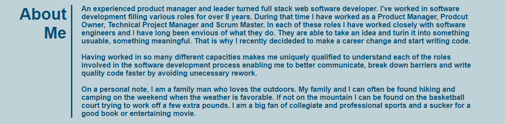
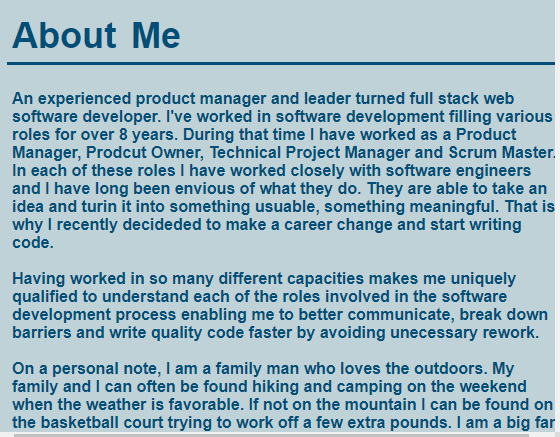
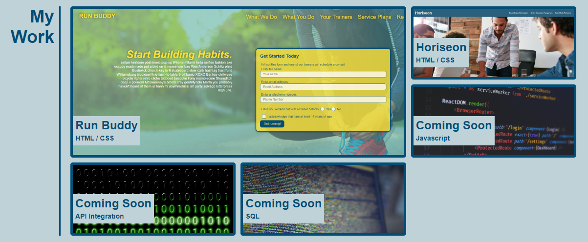
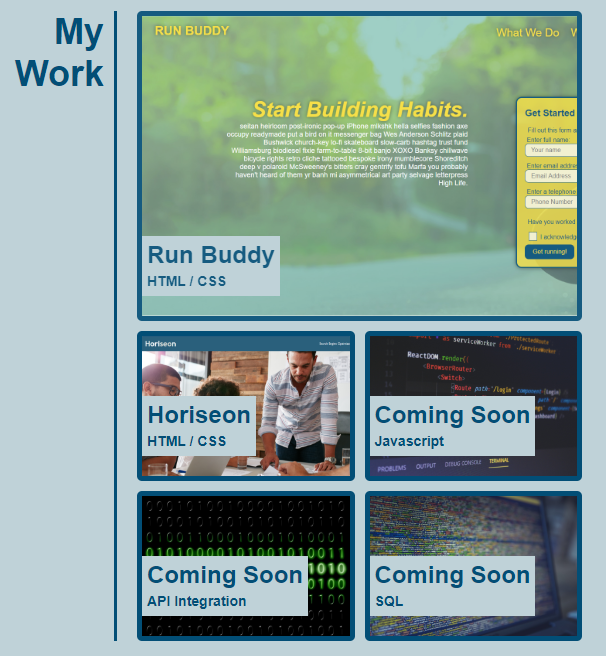
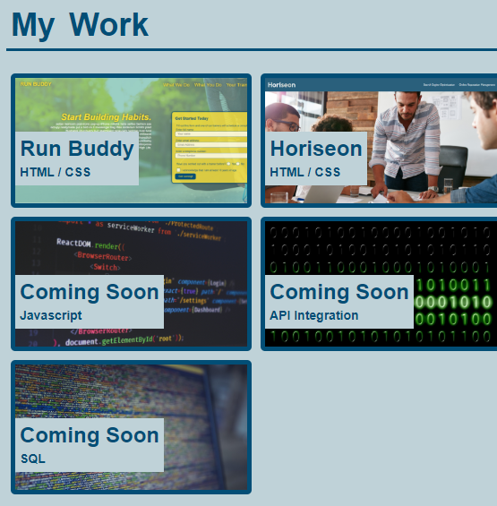
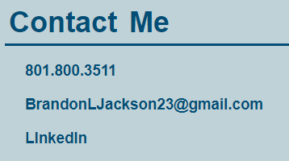

# My Porfolio

## Purpose
A website to show off Brandon Jackson's portfolio of work in full-stack web development

## Website
https://brandonljackson23.github.io/portfolio/

## Overview
The site is responsive website designed to work optimally on desktop, laptop and mobile devices alike with breaking points at 980 px (designed for laptops and smaller monitors), 758 px (designed for tablets) and 575 px (designed for smart phones.) It is comprised of five main sections: Header, Hero, About Me, My Work and Contact Me.

## Header Section
The Header section contains the title and three navigation links that redirect to the other sections (except the Hero section) on the website.

As the window shrinks horizontally the three navigation links shrink in size until the window is smaller than 980 pixels wide when the three nav links drop below the title.

## Hero Section
The Hero section contains a background image along with a headshot of Brandon Jackson captioned by his name.  The image is centered so no need to make adjustments as the window shrinks.

## About Me Section
The About Me section contains a section heading and a short Bio about Brandon Jackson.  It along with the following two sections are wrapped in a flexbox with two columns: section heading (left column) and section content (right column.)

When the window shrinks below 758 pixels wide the margin to the left the section header is removed to make more room on the screen to read.  Once the window shrinks belos 575 pixels the section heading is reformated with bottom border and moved above the section content for improved browsing on mobile devices.

## My Work Section
The My Work section contains a section heading and images containing hyperlinks to websites that Brandon Jackson worked on to show off the work he has done over the course of his software development career. The 3 items labeld as 'Coming Soon' do not link to a site.  They act as placeholders for future sites to be developed later. Like its two adjacent sections it is wrapped in a flexbos with two columns, section heanding and content.  The content column utilizes a grid to arrange the pictures of websites.  The first item in the grid spans 2 rows and 2 columns for emphasis.

Once the window shrinks below 758 pixels wide the grid changes from a 3x3 grid to a 2x5 grid  with the first item still bigger than the rest.

Once the window shrinks below 575 pixels wide the section heading moves atop the content and item one shrinks to match the size of the rest of the items to make it easier to view all the items in the grid on a smaller screen.

## Contact Me Section
The Contact Me section contains a section heading and Brandon's contact information, mainly phone number, email address, a link to his Github profile and a link to his LinkedIn profile.

Once the window shrinks below 575 pixels wide the section heading moves atop the content and the inline list of contact info stacks vertically for better readability on smaller screens.

